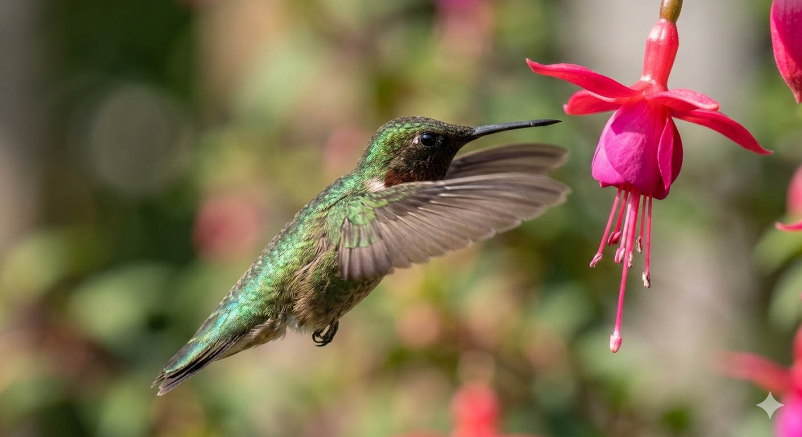
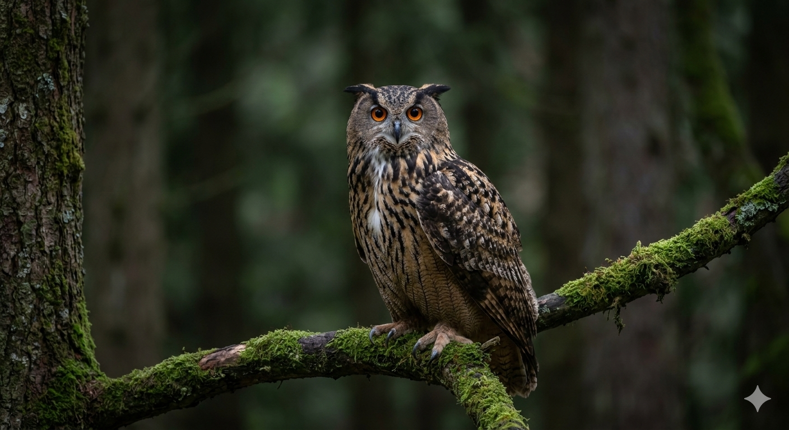

# 🖼️ Repositorio de Aves (Creative Commons)

Este repositorio contiene imágenes de alta calidad de aves, generadas por IA y liberadas bajo licencias permisivas para uso libre.

---

## 1. Colibrí en Acción

* **Descripción:** Un plano detalle de un colibrí gorgirrubio suspendido en el aire junto a una flor de fucsia.
* **Formato:** PNG
* **Licencia:**  (Dominio Público).
**¿Qué significa esta licencia?** La licencia **CC0 (Dominio Público)** es la más permisiva de todas. Al usarla, el autor renuncia a todos sus derechos de propiedad intelectual en todo el mundo. Puedes usar esta imagen para lo que quieras (comercial o personal), modificarla o redistribuirla sin necesidad de mencionar la fuente o pedir permiso.
---

## 2. Búho Real Retrato

* **Descripción:** Un retrato majestuoso de un Búho Real posado en una rama con musgo en un bosque frondoso.
* **Formato:** PNG
* **Licencia:** 
* **Términos:** **Atribución Requerida.** Eres libre de compartir y adaptar la imagen para cualquier propósito, incluso comercial, siempre que des el crédito apropiado, proporciones un enlace a la licencia e indiques si se realizaron cambios.
---

## 3. Guacamayo Macao en Vuelo

### 📝 Explicación del Recurso
Esta fotografía dinámica captura un **Guacamayo Macao** (*Ara macao*) volando sobre el dosel de una selva tropical. La imagen destaca el contraste vibrante de sus plumas rojas, amarillas y azules contra el verde denso del bosque. Es perfecta para representar biodiversidad, ecosistemas tropicales o la libertad de la vida silvestre.

* **Licencia:** 
* **¿Qué significa esta licencia?** La licencia **CC BY-SA (Atribución-CompartirIgual)** te permite remezclar, adaptar y construir sobre esta obra, incluso con fines comerciales. Sin embargo, debes **dar crédito** adecuadamente y, lo más importante, si alteras o transformas esta imagen, la obra resultante debe ser licenciada bajo **los mismos términos** (otra licencia CC BY-SA).
